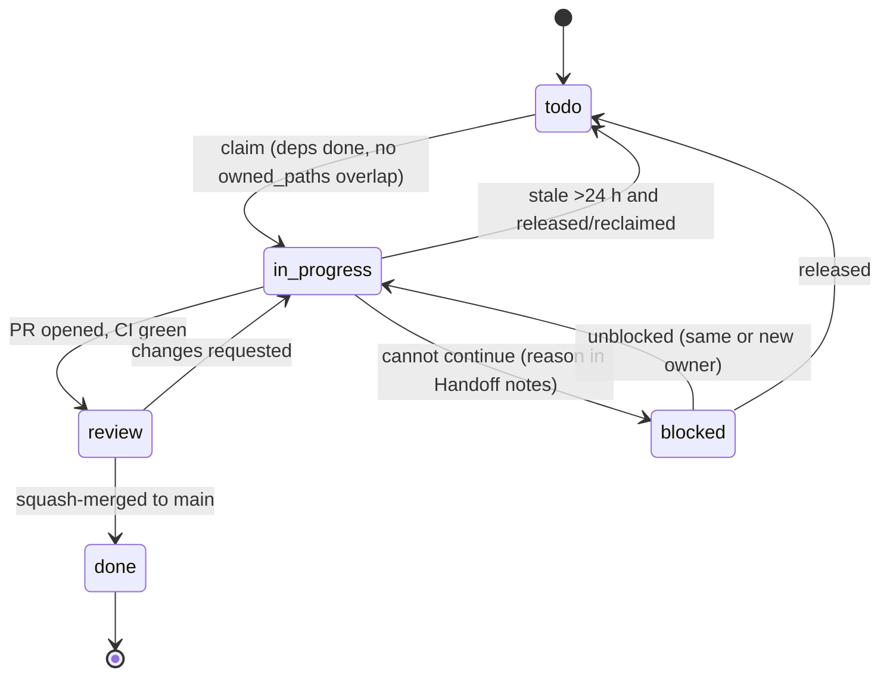

# plans/ — the plan system contract

> **TL;DR:** Every unit of work in this repository is a plan file `plans/PNN-slug.md` with YAML frontmatter (`id, title, milestone, status, owner, branch, model_hint, effort_hint, depends_on, owned_paths, shared_paths, estimate, updated_at, open_questions`) and a fixed body (Goal → Context → Scope → Deliverables → Acceptance criteria → Steps → Tests required → Non-goals/pitfalls → Verification → Handoff notes) (D045, D047). A session **claims** a plan (`node tools/plan/cli.ts claim PNN --owner <name>`, alias `npm run plan -- claim PNN --owner <name>`), works in its own **git worktree** on branch `plan/NN-slug`, touches **only** `owned_paths` (plus `shared_paths` append-only, D048), opens a PR titled `[PNN] <title>`, and the PR is **squash-merged** only when CI is green. `STATE.md` is never hand-edited — it is regenerated by `node tools/plan/cli.ts state`. Claims go stale after 24 h; `depends_on` must all be `done` before a claim; `owned_paths` of two active plans never overlap. Decisions are cited as `(Dnnn)` from [`DECISIONS.md`](../DECISIONS.md) and are never re-litigated inside a plan.

> **Plan files are preserved, verbatim session evidence (D093).** They are written as work is
> done and are not tidied afterwards, so they keep their self-corrections, their measured numbers
> and their unresolved `open_questions`. An open question in a plan is deliberate transparency
> about a decision that belongs to the owner — not a loose end in the shipped site.

---

## 1. Why plans

Sessions of varying model strength and effort execute this project **in parallel**, each resuming from repo state alone (D045). A plan is therefore a self-contained work order: it says what to read, what to build, how to prove it works, and what not to touch. If a plan makes you guess, the plan is wrong — write the question into the plan's `open_questions` and Handoff notes, do not invent a product decision (decisions belong to the owner, recorded in `DECISIONS.md`).

Milestones (D095): **M0** = infrastructure and design (repo scaffold, plan tool, design canvas, tokens, content pipeline, CI, first release); **M1** = English Levels 1–2 (Beginner, Intermediate) live; **M2** = Turkish Levels 1–2 in parallel with English Levels 3–4 (Advanced, Master); **M3** = Turkish Levels 3–4 plus the Playbook and "How this site was built"; **M4** = launch hardening (sources sweep, a11y and analytics review, cache rules).

---

## 2. File format

### 2.1 File name and branch

`plans/PNN-slug.md` — `NN` two digits (`P00`…`P47` at the time of writing; the tool accepts any `P00`–`P99`), `slug` lowercase kebab. Branch `plan/NN-slug` (same slug, no `P`). Worktree directory `../cct-wt-NN` (sibling of the main checkout).

### 2.2 Frontmatter (YAML, required keys)

```yaml
---
id: P13
title: L1 EN — m01-start (setup, first prompt, verify)
milestone: M1                 # M0 | M1 | M2 | M3 | M4
status: todo                  # todo | in_progress | blocked | review | done
owner: null                   # null or a free-form session name, e.g. "sonnet-a-2026-08-25"
branch: plan/13-m01-start
model_hint: opus               # haiku | sonnet | opus | fable  (suggestion for the claiming session)
effort_hint: high              # low | medium | high | xhigh | max
depends_on: [P03, P12]        # plan ids that must be `done` before this one is claimed
owned_paths:                   # globs this plan may create/modify — nothing else
  - content/en/l1-beginner/m01-start/**
shared_paths:                  # files it may touch ONLY additively and with care (see §5)
  - src/content/schema.ts
estimate: M                    # S (≤0.5 day) | M (≤1 day) | L (≤2 days)
updated_at: 2026-09-06T00:00:00Z   # RFC3339 UTC; bumped by every status change
open_questions: []             # optional; doc conflicts / product questions for the owner
---
```

Rules: `id` equals the file prefix; `depends_on` ids must exist and form a DAG; `owned_paths` is never empty; globs use `**` for "this directory and everything below"; `updated_at` is set by `tools/plan`, not by hand (hand edits are tolerated but must be RFC3339 UTC, ending in `Z`).

### 2.3 Body (fixed section order, all required — D047)

1. `## Goal` — one paragraph: what exists when this plan is done and why it matters.
2. `## Context` — which docs/sections to read **before** working (paths + section names, incl. `docs/CURRICULUM.md` and any `DECISIONS.md` entries the plan relies on), what already exists in the repo.
3. `## Scope` — `In:` and `Out:` bullet lists.
4. `## Deliverables` — exact files/dirs to create or change.
5. `## Acceptance criteria` — testable bullets, including the commands to run and the expected result.
6. `## Steps` — ordered, concrete.
7. `## Tests required` — named tests/suites that must exist and pass.
8. `## Non-goals / pitfalls` — what a low-effort session must not do (e.g. "never fabricate command output — D093", "do not touch files outside owned_paths", "never invent an S-decision equivalent — ask in open_questions").
9. `## Verification` — how a reviewer checks the PR in ≤10 minutes.
10. `## Handoff notes` — template filled by the executing session at the end (what changed, what is missing, decisions taken, follow-ups); also where a `blocked` reason lives.

---

## 3. Lifecycle and claim protocol



**Claimable** = `status: todo` (or `in_progress` but stale — `updated_at` older than 24 h relative to the newest `updated_at` in the whole plan set, a clock-free heuristic so the answer never depends on wall-clock skew), **and** every `depends_on` is `done`, **and** none of its `owned_paths` overlaps the `owned_paths` of any non-stale `in_progress`/`review` plan. Overlap is computed on the static prefix of each glob (the part before the first wildcard): two globs overlap if one prefix is a prefix of the other (`content/en/l1-beginner/**` vs `content/en/l1-beginner/m01-start/runtime.test.ts` overlap; `content/en/l1-beginner/**` vs `content/en/l1-intermediate/**` do not).

**Claim** = (1) `git fetch origin && git checkout main && git pull --ff-only`; (2) `node tools/plan/cli.ts next` to see what is claimable; (3) `node tools/plan/cli.ts claim PNN --owner <name>` (sets `status: in_progress`, `owner`, `updated_at`); (4) commit that frontmatter change on a branch `plan/NN-slug` and **push the branch immediately** (`git push -u origin plan/NN-slug`) — the pushed branch is the visible claim for other sessions; (5) create the worktree (§4). Claims that are not pushed do not exist. Two sessions racing for the same plan: the first pushed branch wins; the loser runs `git fetch`, sees the branch, picks another plan.

**Stale** = `in_progress` with `updated_at` older than 24 h relative to the newest timestamp in the set. A stale plan may be reclaimed with `node tools/plan/cli.ts claim PNN --owner <name> --force`; the reclaiming session reads the branch and the Handoff notes first and continues from there (reuse the branch, do not start over).

**Status updates** go through `node tools/plan/cli.ts status PNN <status> [--reason "..."]`; every update bumps `updated_at`. `review` is set when the PR is opened and CI is green; `done` is set by the merging session (or in the next plan's PR) after the squash merge, followed by `node tools/plan/cli.ts state` to refresh `STATE.md`.

---

## 4. Worktree workflow (commands)

```bash
# once per clone
sh scripts/install-hooks.sh                      # pre-push hook: blocks direct pushes to main

# claim (run from the main checkout, on up-to-date main)
git fetch origin && git checkout main && git pull --ff-only
node tools/plan/cli.ts next
node tools/plan/cli.ts claim P13 --owner sonnet-b
git checkout -b plan/13-m01-start
git add plans/P13-m01-start.md && git commit -m "chore(plans): claim P13"
git push -u origin plan/13-m01-start

# isolated worktree (sibling directory, same branch)
git worktree add ../cct-wt-13 plan/13-m01-start
cd ../cct-wt-13
npm ci                                           # each worktree has its own node_modules
# ... implement inside owned_paths only ...
node tools/plan/cli.ts check                     # frontmatter + DAG + overlap + STATE.md freshness
npm run typecheck && npm run lint && npm test && npm run gate && npm run build
git add -A && git commit -m "feat(content): m01-start lesson (P13)"
git push
gh pr create --title "[P13] L1 EN — m01-start" --body-file .github/PULL_REQUEST_TEMPLATE.md   # then fill it in
node tools/plan/cli.ts status P13 review && git add plans && git commit -m "chore(plans): P13 review" && git push

# after squash-merge (by the reviewer/merger, on main)
gh pr merge <n> --squash --delete-branch
git checkout main && git pull --ff-only
node tools/plan/cli.ts status P13 done && node tools/plan/cli.ts state
git add plans STATE.md && git commit -m "chore(plans): P13 done" && git push    # small, CI-fast plan-only PR
git worktree remove ../cct-wt-13
```

Windows hosts use Git Bash for these commands (`scripts/*.sh` are POSIX, `.gitattributes` forces LF). Never `cd` into another plan's worktree to "borrow" a file — if you need it, the dependency is missing from `depends_on`; write that in your Handoff notes.

---

## 5. Owned paths and shared paths

- You may create/modify files only under your plan's `owned_paths`. Reading anything is fine.
- `shared_paths` lists files touched by many plans. Rules for them: **append-only / minimal-diff**, never reformat or reorder existing content, one logical hunk per shared file, and mention each shared-file change in the PR body. Conflicts on shared files are resolved by rebasing on `main` (`git fetch && git rebase origin/main`) and re-running the generator where one exists (`npm install`, `node tools/plan/cli.ts state`).
- Known shared files and their owners of last resort:

| File / dir | Rule |
|---|---|
| `package.json`, `package-lock.json` | add dependencies only via `npm install <pkg>@<version>`; never bump unrelated versions |
| `src/content/schema.ts` | additive only — new collections or optional fields; never rename or remove an existing field |
| `src/lib/i18n/ui.ts` | add keys under your own namespace; never rename existing keys |
| `.github/workflows/*.yml` | only plans that explicitly list a workflow file in `owned_paths`/`shared_paths` touch it; add jobs/steps, do not rewrite |
| `STATE.md` | generated only — `node tools/plan/cli.ts state` |
| `DECISIONS.md` | owner-approved PR only; a plan may propose a change but never edits it directly |
| `docs/CURRICULUM.md` | P03 owns; every other plan reads it, never edits it (route a needed change through P03's `open_questions`) |

If a plan needs a file outside its `owned_paths`, stop: either the file belongs in `shared_paths` (ask in Handoff notes; a small follow-up PR may add it) or the dependency graph is wrong. Do not "just touch it".

---

## 6. Definition of Done and PR conventions

A plan is **done** when all of the following hold:

1. The PR is squash-merged into `main` with CI green: `npm run typecheck`, `npm run lint`, `node tools/plan/cli.ts check`, `npm run gate` (EN/TR parity, schema, fenced-code checks), `npm test` (vitest, coverage gate), `npm run build`, and `npm run test:e2e` (Playwright + axe) when the plan touches rendered pages.
2. Every item under **Tests required** exists and passes; the PR body pastes real command output (the evidence rule, D093 — fabricated output is forbidden).
3. Docs are in sync: the plan's Context says which doc sections to update when behaviour differs; `DECISIONS.md`/`docs/CURRICULUM.md` change only through their owners.
4. Frontmatter is `review` at PR time and `done` after merge; `STATE.md` regenerated (`node tools/plan/cli.ts state`) in the same PR or the very next plan PR.
5. No file outside `owned_paths` changed (except listed `shared_paths`, append-only).
6. Deploy + live smoke only for release plans — other plans never deploy.

**PR title:** `[PNN] <plan title>`. **Squash commit message:** conventional commit with the plan id at the end, e.g. `feat(content): m01-start lesson — setup, first prompt, verify (P13)`; types `feat|fix|docs|chore|test|refactor|ci|build`, scopes = area (`content`, `i18n`, `design`, `ci`, `deploy`, `plans`, …). **PR body:** use `.github/PULL_REQUEST_TEMPLATE.md` — sections Plan · What changed · How to try it · Evidence (screenshots at 390 px + 1280 px for UI, real command output for everything else) · DoD checklist · Handoff notes. Screenshots are attached to the PR, never committed.

Tiny housekeeping PRs (`chore(plans): P13 done`) are allowed and expected; they need CI too (it is fast for plan-only changes because `node tools/plan/cli.ts check` is the only relevant job). Never push to `main` directly (pre-push hook + policy).

---

## 7. `STATE.md` and the `tools/plan` CLI

`STATE.md` is generated by `node tools/plan/cli.ts state` from the frontmatter of every `plans/P*.md`. It is deterministic (same inputs ⇒ byte-identical output) so a CI check can fail when it is stale. Layout:

1. `> **TL;DR:**` — counts per milestone (`done/total`), the current wave (claimable plans), how many plans are in progress/review/blocked — no timestamps of its own, to stay deterministic.
2. **Milestone progress** — table: milestone · done · review · in_progress · blocked · todo · total.
3. **Claimable now** — id · title · model_hint · effort_hint · estimate (sorted by id).
4. **In progress** — id · title · owner · branch · since (`updated_at`) · `STALE` marker when >24 h old relative to the newest `updated_at` in the set (clock-free heuristic) — plus a one-line "Stale plans may be reclaimed with --force".
5. **Blocked** — id · title · owner · the newest `- Blocked (...)` line from the Handoff notes.
6. **In review** — id · title · owner · branch.
7. **Done** — compact list per milestone.
8. **Recent changes** — the 10 plans with the newest `updated_at` (id · status · updated_at · owner).
9. **Open questions** — every non-empty `open_questions` entry with its plan id.

CLI (`tools/plan/cli.ts`, Node 24 native TypeScript; the only runtime dependency is `yaml`):

| Command | Effect |
|---|---|
| `node tools/plan/cli.ts state` | rewrite `STATE.md` |
| `node tools/plan/cli.ts next` | print claimable plans (see §3 rule) |
| `node tools/plan/cli.ts claim PNN --owner NAME [--force]` | set `in_progress`, `owner`, `updated_at=now`; refuses when not claimable unless `--force` on a stale plan |
| `node tools/plan/cli.ts status PNN todo\|in_progress\|blocked\|review\|done [--reason TEXT]` | set status + `updated_at`; `blocked` requires `--reason`, which is appended under `## Handoff notes` as `- Blocked (YYYY-MM-DD): TEXT`; `todo` clears `owner` |
| `node tools/plan/cli.ts check` | exit 1 on: missing/invalid frontmatter keys, id≠filename, unknown `depends_on`, cycle, empty `owned_paths`, overlap between two active plans, `in_progress`/`review` plan whose deps are not `done`, `STATE.md` differs from what `state` would write |
| `node tools/plan/cli.ts show PNN` | print frontmatter + section headings (sanity) |

Every command accepts `--dir PATH` (plans directory, default `<repo root>/plans`) and `--state PATH` (`STATE.md` path, default `<repo root>/STATE.md`); the repo root is the nearest ancestor directory containing `package.json`. `npm run plan -- <args>` is the same CLI via the package script. CI runs `node tools/plan/cli.ts check` on every PR. If it fails because `STATE.md` is stale, run `node tools/plan/cli.ts state` and commit.

---

## 8. When you are blocked

1. `node tools/plan/cli.ts status PNN blocked --reason "what blocks you, what you tried, what you need"`; commit and push the branch (draft PR welcome).
2. If the blocker is a **missing dependency**, name the plan id that should provide it; if no plan does, add a line under `open_questions` ("P?? should own X") — do not create new plan files yourself unless the plan set says so (the owner or the lead session curates plans).
3. If the blocker is a **doc conflict**, prefer `docs/CURRICULUM.md` for curriculum/scope questions and `DECISIONS.md` for anything already decided; if neither covers it, write the question into `open_questions` and continue with the most conservative reading. Never change a recorded decision yourself.
4. If the blocker is an **owner action** (secret, DNS/Cloudflare setting, approval), write the exact action needed in Handoff notes and pick another plan (`node tools/plan/cli.ts next`).
5. Escalate model/effort rather than guessing on architecture, curriculum structure, or anything a stronger hint exists for (see §9).

---

## 9. Model and effort hints

| Hint | Meaning | Typical plans |
|---|---|---|
| `haiku` / `low` | mechanical, fully specified, copy-from-doc work | sources sweeps, fixtures, glue, docs sync |
| `sonnet` / `medium` | normal feature work with tests | infra/scaffold/deploy, CI wiring, translation, UI components |
| `opus` / `high` | judgement-heavy content and UI work | lesson authoring, MDX components, board/interaction UI |
| `fable` / `xhigh` \| `max` | architecture and system-level design judgement | the design canvas, the curriculum map, cross-cutting composition decisions |

The hint is advice to the claiming session, not a gate: if you find yourself inventing a decision, escalate (write it in Handoff notes and re-claim with a stronger model).

---

## 10. Session checklist

**Start:** read `STATE.md` → this file → `DECISIONS.md` → `docs/CURRICULUM.md` → the plan's Context docs → `node tools/plan/cli.ts next` → claim → push branch → worktree.
**During:** stay in `owned_paths`; write tests as you go; keep the plan file's Handoff notes updated with decisions; never commit secrets (`.env*`); never fabricate command output (D093); never sleep in tests (inject clocks).
**End:** `node tools/plan/cli.ts check`; full local gate; PR with evidence; `status review`; after merge `status done` + `state` (own PR or the next).
